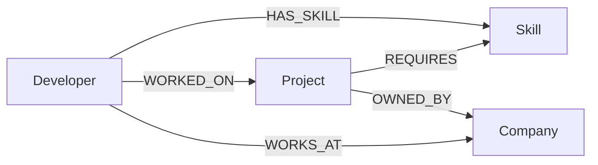

# SkillGraph

SkillGraph is a full-stack developer skill and project recommendation dashboard. Select a developer to explore their profile, connected skills, previous projects, and projects ranked by shared skill coverage.

## Use Case

Skill and project data is naturally connected: a developer has skills, projects require skills, developers work on projects, and projects belong to companies. SkillGraph makes those connections useful by finding projects that match a developer's existing skills.

## Features

- Select from seeded developers and view basic profile information.
- Explore a developer's skills and worked-on projects.
- Recommend projects using relationship-based skill overlap.
- Display matched skills, required skill counts, and match percentages.
- Provide loading, empty, and error states in a responsive dashboard.
- Verify CognoDB connectivity through a health endpoint.

## Technology Stack

- Frontend: React, Vite, JavaScript, CSS
- Backend: Node.js, Express.js, `cors`, `dotenv`
- Database access: `neo4j-driver` over Bolt
- Database: CognoDB using openCypher

## Why a Graph Database?

The core recommendation follows this relationship path:

```text
Developer -> HAS_SKILL -> Skill <- REQUIRES <- Project
```

The query can start at one developer, traverse to all connected skills, then traverse backwards to every project requiring those skills. A second useful path is:

```text
Developer -> WORKED_ON -> Project -> OWNED_BY -> Company
```

Relational databases can also solve these queries with joins. A graph model expresses relationship-heavy traversal more naturally, keeps the domain relationships visible, and is easier to extend with new connections such as team membership, project technologies, or company offices.

## Graph Data Model



| Type | Important properties | Meaning |
| --- | --- | --- |
| `Developer` | `id`, `name`, `experienceYears`, `location` | A developer available for exploration. |
| `Skill` | `id`, `name`, `category` | A technical skill connected to developers and projects. |
| `Project` | `id`, `name`, `description`, `difficulty`, `category` | A project that may require skills and belong to a company. |
| `Company` | `id`, `name`, `industry` | An organization employing developers or owning projects. |
| `HAS_SKILL` | None | Connects a developer to a skill. |
| `WORKED_ON` | None | Connects a developer to a project they worked on. |
| `REQUIRES` | None | Connects a project to a skill it needs. |
| `OWNED_BY` | None | Connects a project to its company. |
| `WORKS_AT` | None | Connects a developer to their company. |

## Architecture

```text
React/Vite
    |
    v
Express/Node.js API
    |
    v
Neo4j JavaScript Driver
    |
    v
CognoDB
    |
    v
Graph nodes + relationships
```

## CognoDB Setup

1. Create a free CognoDB instance.
2. Obtain its Bolt connection URI.
3. Copy the backend environment template:

   ```powershell
   Copy-Item backend/.env.example backend/.env
   ```

4. Configure `backend/.env` with your own values:

   ```env
   COGNODB_URI=bolt+s://your-instance.databases.cognodb.com
   COGNODB_USERNAME=cognodb
   COGNODB_PASSWORD=your-password
   PORT=5000
   ```

Never commit `.env`, share its values, or place credentials in source code. `.env` is ignored by Git through the repository `.gitignore` files. Use placeholder values only in templates and documentation.

## Installation

From the repository root, run the existing installation script:

```powershell
npm run install:all
```

This installs dependencies independently for `backend` and `frontend`.

## Run the Backend

After configuring `backend/.env`:

```powershell
npm run dev:backend
```

The backend listens on `http://localhost:5000` by default. It verifies CognoDB connectivity when it starts.

## Run the Frontend

In a second terminal:

```powershell
npm run dev:frontend
```

The frontend uses `http://localhost:5000/api` by default. To override it, create `frontend/.env` with:

```env
VITE_API_URL=http://localhost:5000/api
```

## Seed the Database

With valid CognoDB credentials configured, run:

```powershell
npm run seed
```

The seed creates or merges:

- 8 developers
- 12 skills
- 10 projects
- 5 companies
- `HAS_SKILL`, `WORKED_ON`, `REQUIRES`, `OWNED_BY`, and `WORKS_AT` relationships

The script uses parameterized Cypher and `MERGE`, so repeated runs avoid duplicate nodes and relationships. It does not delete existing graph data.

## API Endpoints

All responses use JSON. Developer IDs are validated by the backend.

| Method | Endpoint | Purpose |
| --- | --- | --- |
| `GET` | `/api/health` | Verify API and CognoDB connectivity. |
| `GET` | `/api/developers` | List all developers. |
| `GET` | `/api/developers/:id` | Get one developer by ID. |
| `GET` | `/api/developers/:id/skills` | List skills connected to a developer. |
| `GET` | `/api/developers/:id/projects` | List projects a developer worked on. |
| `GET` | `/api/developers/:id/recommendations` | List projects ranked by skill overlap. |
| `GET` | `/api/projects` | List all projects. |
| `GET` | `/api/skills` | List all skills. |

## Main Cypher Queries

The application keeps user input in query parameters rather than concatenating it into Cypher.

Get a developer's skills from `backend/src/services/developerService.js`:

```cypher
MATCH (d:Developer {id: $id})-[:HAS_SKILL]->(s:Skill)
RETURN s ORDER BY s.name
```

Get projects a developer worked on:

```cypher
MATCH (d:Developer {id: $id})-[:WORKED_ON]->(p:Project)
RETURN p ORDER BY p.name
```

The recommendation query in `backend/src/services/recommendationService.js` traverses the developer's skills and project requirements:

```cypher
MATCH (d:Developer {id: $developerId})-[:HAS_SKILL]->(skill:Skill)
WITH d, collect(skill) AS developerSkills
MATCH (project:Project)-[:REQUIRES]->(required:Skill)
WITH d, developerSkills, project, collect(required) AS requiredSkills
WITH project, requiredSkills,
  [skill IN requiredSkills WHERE skill IN developerSkills] AS matchedSkills
WHERE size(matchedSkills) > 0
RETURN project,
  [skill IN matchedSkills | skill.name] AS matchedSkills,
  size(matchedSkills) AS matchedSkillCount,
  size(requiredSkills) AS totalRequiredSkills,
  CASE WHEN size(requiredSkills) = 0 THEN 0.0
    ELSE round((100.0 * size(matchedSkills) / size(requiredSkills)) * 100) / 100
  END AS matchPercentage
ORDER BY matchPercentage DESC, project.name
```

Here, `matchedSkillCount` counts required skills also owned by the developer. `totalRequiredSkills` counts all skills required by the project. `matchPercentage` is calculated as `matchedSkillCount / totalRequiredSkills * 100`, rounded to two decimal places using the one-argument `round()` supported by CognoDB.

The documented multi-hop company traversal in `backend/queries/queries.cypher` is:

```cypher
MATCH (d:Developer {id: $developerId})-[:WORKED_ON]->(:Project)-[:OWNED_BY]->(company:Company)
RETURN DISTINCT company
```

This connects a developer to companies through their project history and demonstrates why adding another relationship hop is a natural graph operation.

## Error Handling

- Unknown developers return HTTP `404` with a JSON error message.
- Invalid developer IDs return HTTP `400` with a JSON error message.
- Database or unexpected API failures return HTTP `500` or `503` for health-check connectivity failures.
- Unknown routes return HTTP `404`.

## Screenshots

No screenshot assets currently exist in the repository. Add these files manually under `screenshots/` after running the application:

- `screenshots/dashboard.png`: Main dashboard with the SkillGraph header.
- `screenshots/developer-selection.png`: Developer dropdown with a selected developer.
- `screenshots/skills.png`: Selected developer profile and skills section.
- `screenshots/recommendations.png`: Recommended project cards showing match percentages and matched skills.

## Future Improvements

- Add project and company detail pages.
- Add filters for skill category, location, difficulty, and company.
- Add authentication and saved recommendations.
- Add pagination and a visual graph explorer for larger datasets.
- Add automated API and component tests.
